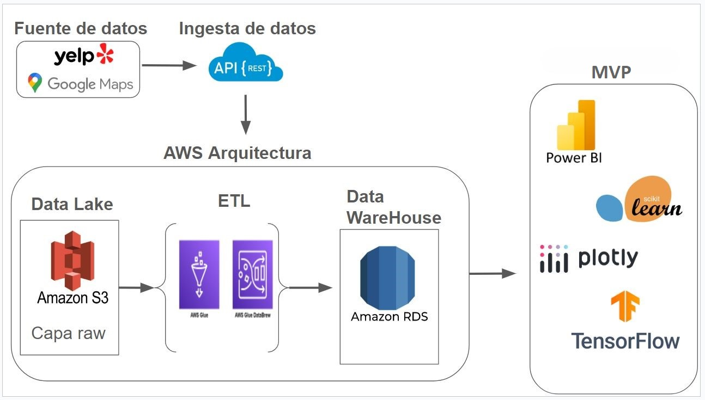
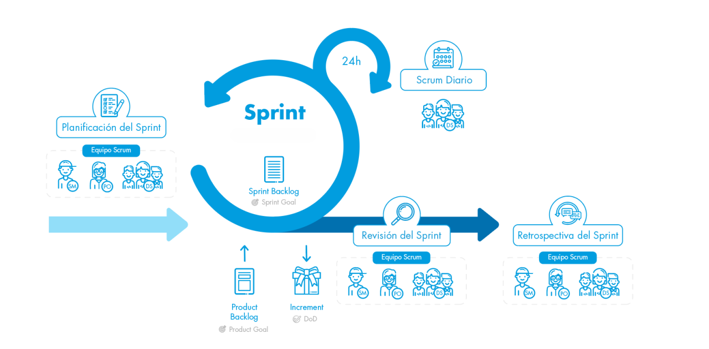
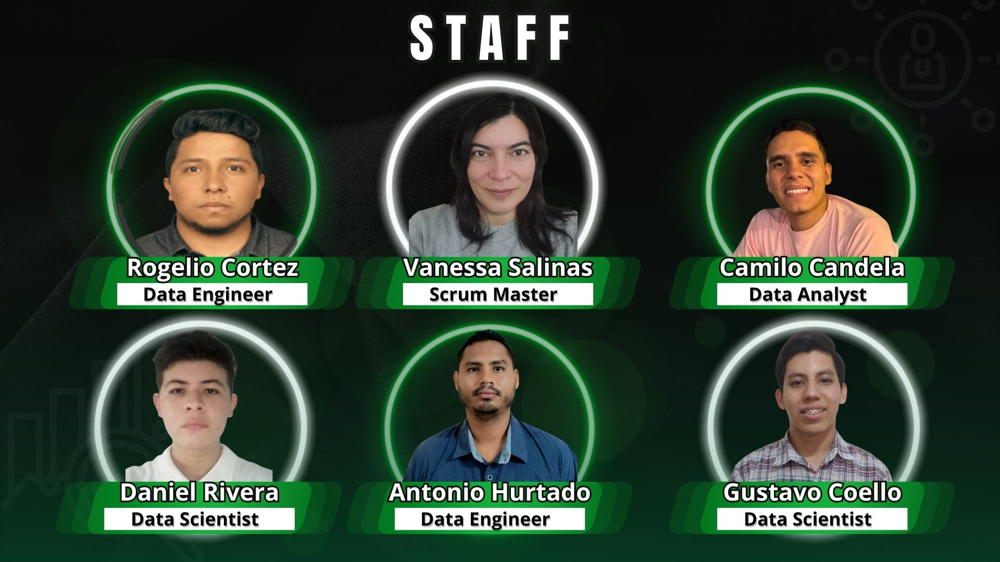

<link rel="stylesheet" href="src/styles.css">

  
  <h1 align=center> YELP & GOOGLE MAPS - REVIEWS AND RECOMMENDATIONS </h1>

## Introduccion

## Tabla de contenido
* **[Contexto](#contexto)**
* **[Objetivos y alcance](#objetivos-y-alcance)**
* **[Arquitectura](#arquitectura)**
* **[Stack Tecnologico](#stack-tecnologico)**
* **[Analisis exploratorio de datos (EDA)](#analisis-exploratorio-de-datos-(EDA))**
* **[KPIs](#kpis)**
* **[Metodologia de trabajo](#metodologia-de-trabajo)**
* **[Estructura del repositorio](#estructura-del-repositorio)**
* **[Equipo de Trabajo](#equipo-de-trabajo)**

## Contexto

[Tabla de contenido](#tabla-de-contenido)

## Objetivos y alcance

Desarrollar una solución de inteligencia de negocios personalizada, utilizando tecnicas de analisis de datos y aprendizaje automatico, para potenciar a las empresas administradoras de los estadios sedes del Mundial FIFA 2026 brindando un informe detallado de las tendencias del mercado estadounidense en los rubros hotelería y gastronomía, mediante un analisis exhaustivo de reseñas en Yelp y Google Maps. A través de la implementación de un dashboard interactivo y un sistema de recomendación para dichos rubros, se busca facilitar la toma de decisiones estratégicas, identificar oportunidades de negocio y optimizar la experiencia de los visitantes, mejorando la reputación de las ciudades sede y aumentando la demanda de servicios locales.

* Contribuir a la toma de decisiones informadas de los administradores de los estadios, facilitando la identificación de áreas clave para inversión que maximicen la experiencia de los asistentes y optimicen los recursos disponibles
* Garantizar a la administración de cada estadio sede del Mundial de Fútbol FIFA 2026 un análisis detallado del mercado estadounidense en el rubro hoteles, restaurantes y afines
* Brindar un sistema de recomendación para quienes asistan a las sedes del Mundial, abarcando hoteles, restaurantes y lugares turísticos, con el fin de garantizar una estancia más satisfactoria.

[Tabla de contenido](#tabla-de-contenido)

## Arquitectura

  

[Tabla de contenido](#tabla-de-contenido)

## Stack Tecnologico

                          

 

[Tabla de contenido](#tabla-de-contenido)

## Analisis exploratorio de datos (EDA)

Puedes ver un resumen del análisis realizado en el siguiente enlace: [Analisis preliminar de la calidad de datos](https://docs.google.com/spreadsheets/d/1PTvthKxuiTSu4wNjCaOBaA0fZNWX6wQAIVMeRPGVfnM/edit?usp=drive_link)

[Tabla de contenido](#tabla-de-contenido)

## KPIs

* **Tasa de disminución de reseñas negativas**  
Reducir un 2% el número de reseñas negativas respecto al mes anterior

* **Tasa de aumento en la demanda de restaurantes**  
Incremento de un 2 % en la demanda de restaurantes por semestre en la ciudad.

* **Tasa de aumento en número de hoteles**  
Incremento de un 2 % en número de hoteles por año en la ciudad.  

[Tabla de contenido](#tabla-de-contenido)

## Metodologia de trabajo

  

Para la organización de este proyecto implementamos la metodología SCRUM, por ser un marco de trabajo ágil y colaborativo con el fin obtener el mejor resultado posible de un proyecto.

[Tabla de contenido](#tabla-de-contenido)

## Estructura del repositorio

* EDA_preliminar: Carpeta que almacena los archivos para el EDA inicial.
* Fundamentacion: Carpeta que almacena la documentacion del proyecto.
* src/img: carpeta que almacena imagenes que se encuentran en el repositorio.
* .gitignore: archivo que indica lo que no debe ser rastreado por git
* README.md: archivo con el readme del proyecto donde podras ver la presentacion del mismo.

[Tabla de contenido](#tabla-de-contenido)

## Equipo de Trabajo

  

[Tabla de contenido](#tabla-de-contenido)

## Contacto

* **Candela, Camilo**

* **Coello, Gustavo**

* **Cortez, Rogelio**

* **Hurtado, Antonio**

* **Rivera, Daniel**

* **Salinas Vanessa**

[Tabla de contenido](#tabla-de-contenido)

## Agradecimientos

***Este proyecto fue desarrollado durante la etapa de Labs del Bootcamp de [Henry](https://www.soyhenry.com/nosotros). Agradecemos a todo el staff por su acompañamiento durante todo el proceso de aprendizaje.***

