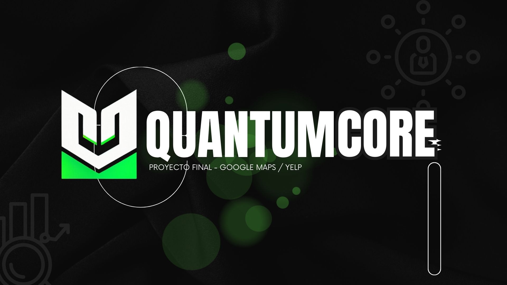

  

# PF_Google_Yelp

## Introduccion

## Tabla de contenido
* **[Contexto](#contexto)**
* **[Objetivos y alcance](#objetivos-y-alcance)**
* **[Arquitectura](#arquitectura)**
* **[Stack Tecnologico](#stack-tecnologico)**
* **[Analisis exploratorio de datos (EDA)](#analisis-exploratorio-de-datos-(EDA))**
* **[KPIs](#kpis)**
* **[Metodologia de trabajo](#metodologia-de-trabajo)**
* **[Resultados](#resultados)**
* **[Estructura del repositorio](#estructura-del-repositorio)**
* **[Equipo de Trabajo](#equipo-de-trabajo)**

## Contexto

[Tabla de contenido](#tabla-de-contenido)

## Objetivos y alcance

[Tabla de contenido](#tabla-de-contenido)

## Arquitectura

  

[Tabla de contenido](#tabla-de-contenido)

## Stack Tecnologico

[Tabla de contenido](#tabla-de-contenido)

## Analisis exploratorio de datos (EDA)

[Tabla de contenido](#tabla-de-contenido)

## KPIs

[Tabla de contenido](#tabla-de-contenido)

## Metodologia de trabajo

[Tabla de contenido](#tabla-de-contenido)

## Resultados

[Tabla de contenido](#tabla-de-contenido)

## Estructura del repositorio

[Tabla de contenido](#tabla-de-contenido)

## Equipo de Trabajo

  

[Tabla de contenido](#tabla-de-contenido)

## Contacto

[Tabla de contenido](#tabla-de-contenido)

## Agradecimientos

***Este proyecto fue desarrollado durante la etapa de Labs del Bootcamp de [Henry](https://www.soyhenry.com/nosotros). Agradecemos a todo el staff por su acompañamiento durante todo el proceso de aprendizaje.***

